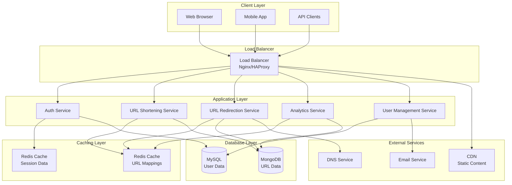

# URL Shortener System Design

## Overview
A URL shortener service like bit.ly or tinyurl.com that converts long URLs into short, manageable links. The system should handle millions of requests, provide high availability, and scale horizontally.

## System Requirements

### Functional Requirements
- **URL Shortening**: Convert long URLs to short aliases
- **URL Redirection**: Redirect short URLs to original URLs
- **Custom Aliases**: Allow users to specify custom short URLs
- **Analytics**: Track click counts and basic analytics
- **User Management**: User registration and authentication
- **URL Management**: Edit, delete, and manage URLs

### Non-Functional Requirements
- **High Availability**: 99.9% uptime
- **Low Latency**: < 100ms for URL redirection
- **Scalability**: Handle 100M URLs and 1000 requests/second
- **Durability**: No URL loss
- **Security**: Prevent spam and malicious URLs

## System Architecture



## Core Components

### 1. URL Shortening Service
**Purpose**: Generate short URLs from long URLs

**Algorithm Options**:
- **Base62 Encoding**: Convert auto-incrementing ID to base62 string
- **Hash-based**: Use MD5/SHA-256 hash of URL
- **Random Generation**: Generate random short codes

**Implementation**:
```python
import base64
import hashlib
import random
import string

class URLShortener:
    def __init__(self):
        self.chars = string.ascii_letters + string.digits
        self.base = len(self.chars)
    
    def encode_base62(self, num):
        """Convert number to base62 string."""
        if num == 0:
            return self.chars[0]
        
        result = []
        while num:
            num, remainder = divmod(num, self.base)
            result.append(self.chars[remainder])
        
        return ''.join(reversed(result))
    
    def generate_short_url_hash(self, long_url, user_id=None):
        """Generate short URL using hash method."""
        # Add user_id to prevent collisions
        salt = user_id or "default"
        combined = f"{long_url}{salt}{random.random()}"
        
        # Generate hash
        hash_obj = hashlib.md5(combined.encode())
        hash_hex = hash_obj.hexdigest()
        
        # Convert to base62 and take first 6 characters
        hash_int = int(hash_hex[:8], 16)
        short_code = self.encode_base62(hash_int)
        
        return short_code[:6]  # Limit to 6 characters
    
    def generate_short_url_counter(self, counter):
        """Generate short URL using counter method."""
        return self.encode_base62(counter)
```

### 2. URL Redirection Service
**Purpose**: Redirect short URLs to original URLs

**Implementation**:
```python
from flask import Flask, redirect, request, jsonify
import redis
import pymongo

class URLRedirector:
    def __init__(self):
        self.redis_client = redis.Redis(host='localhost', port=6379, db=0)
        self.mongo_client = pymongo.MongoClient('mongodb://localhost:27017/')
        self.db = self.mongo_client['urlshortener']
        self.urls = self.db['urls']
    
    def redirect_url(self, short_code):
        """Redirect short URL to original URL."""
        # Try cache first
        original_url = self.redis_client.get(f"url:{short_code}")
        
        if not original_url:
            # Check database
            url_doc = self.urls.find_one({"short_code": short_code})
            if url_doc:
                original_url = url_doc['original_url']
                # Cache for 1 hour
                self.redis_client.setex(f"url:{short_code}", 3600, original_url)
            else:
                return None, "URL not found"
        
        # Log analytics
        self.log_click(short_code, request.remote_addr, request.headers.get('User-Agent'))
        
        return original_url.decode() if isinstance(original_url, bytes) else original_url, None
    
    def log_click(self, short_code, ip, user_agent):
        """Log click analytics."""
        click_data = {
            "short_code": short_code,
            "ip": ip,
            "user_agent": user_agent,
            "timestamp": datetime.utcnow()
        }
        self.db.clicks.insert_one(click_data)
```

### 3. Database Schema

**MySQL Schema (User Management)**:
```sql
-- Users table
CREATE TABLE users (
    id INT PRIMARY KEY AUTO_INCREMENT,
    username VARCHAR(50) UNIQUE NOT NULL,
    email VARCHAR(100) UNIQUE NOT NULL,
    password_hash VARCHAR(255) NOT NULL,
    created_at TIMESTAMP DEFAULT CURRENT_TIMESTAMP,
    updated_at TIMESTAMP DEFAULT CURRENT_TIMESTAMP ON UPDATE CURRENT_TIMESTAMP
);

-- User sessions
CREATE TABLE user_sessions (
    id INT PRIMARY KEY AUTO_INCREMENT,
    user_id INT NOT NULL,
    session_token VARCHAR(255) UNIQUE NOT NULL,
    expires_at TIMESTAMP NOT NULL,
    created_at TIMESTAMP DEFAULT CURRENT_TIMESTAMP,
    FOREIGN KEY (user_id) REFERENCES users(id)
);
```

**MongoDB Schema (URL Data)**:
```javascript
// URLs collection
{
  "_id": ObjectId("..."),
  "short_code": "abc123",
  "original_url": "https://www.example.com/very/long/url",
  "user_id": 123,
  "custom_alias": "my-link", // optional
  "created_at": ISODate("2023-01-01T00:00:00Z"),
  "expires_at": ISODate("2024-01-01T00:00:00Z"), // optional
  "click_count": 0,
  "is_active": true,
  "title": "Example Page", // optional
  "description": "Short description" // optional
}

// Analytics collection
{
  "_id": ObjectId("..."),
  "short_code": "abc123",
  "ip_address": "192.168.1.1",
  "user_agent": "Mozilla/5.0...",
  "referrer": "https://google.com",
  "country": "US",
  "city": "New York",
  "timestamp": ISODate("2023-01-01T12:00:00Z"),
  "device_type": "desktop",
  "browser": "Chrome"
}
```

## API Design

### RESTful Endpoints

```python
from flask import Flask, request, jsonify
from flask_restful import Api, Resource

class URLShortenerAPI:
    def __init__(self):
        self.app = Flask(__name__)
        self.api = Api(self.app)
        self.setup_routes()
    
    def setup_routes(self):
        self.api.add_resource(ShortenURL, '/api/v1/shorten')
        self.api.add_resource(GetURL, '/api/v1/url/<short_code>')
        self.api.add_resource(DeleteURL, '/api/v1/url/<short_code>')
        self.api.add_resource(GetAnalytics, '/api/v1/analytics/<short_code>')
        self.api.add_resource(UserURLs, '/api/v1/user/urls')
    
    def run(self):
        self.app.run(debug=True)

class ShortenURL(Resource):
    def post(self):
        """Shorten a URL."""
        data = request.get_json()
        original_url = data.get('url')
        custom_alias = data.get('custom_alias')
        user_id = get_current_user_id()
        
        if not original_url:
            return {'error': 'URL is required'}, 400
        
        # Validate URL
        if not self.is_valid_url(original_url):
            return {'error': 'Invalid URL format'}, 400
        
        # Generate short code
        shortener = URLShortener()
        if custom_alias:
            short_code = custom_alias
            if self.short_code_exists(short_code):
                return {'error': 'Custom alias already exists'}, 409
        else:
            short_code = shortener.generate_short_url_hash(original_url, user_id)
        
        # Save to database
        url_doc = {
            'short_code': short_code,
            'original_url': original_url,
            'user_id': user_id,
            'custom_alias': custom_alias,
            'created_at': datetime.utcnow(),
            'click_count': 0,
            'is_active': True
        }
        
        result = self.db.urls.insert_one(url_doc)
        
        return {
            'short_code': short_code,
            'short_url': f"https://short.ly/{short_code}",
            'original_url': original_url,
            'created_at': url_doc['created_at'].isoformat()
        }, 201
    
    def is_valid_url(self, url):
        """Validate URL format."""
        import re
        pattern = re.compile(
            r'^https?://'  # http:// or https://
            r'(?:(?:[A-Z0-9](?:[A-Z0-9-]{0,61}[A-Z0-9])?\.)+[A-Z]{2,6}\.?|'  # domain...
            r'localhost|'  # localhost...
            r'\d{1,3}\.\d{1,3}\.\d{1,3}\.\d{1,3})'  # ...or ip
            r'(?::\d+)?'  # optional port
            r'(?:/?|[/?]\S+)$', re.IGNORECASE)
        return pattern.match(url) is not None

class GetURL(Resource):
    def get(self, short_code):
        """Get URL details."""
        url_doc = self.db.urls.find_one({'short_code': short_code})
        if not url_doc:
            return {'error': 'URL not found'}, 404
        
        return {
            'short_code': url_doc['short_code'],
            'original_url': url_doc['original_url'],
            'click_count': url_doc['click_count'],
            'created_at': url_doc['created_at'].isoformat()
        }

class DeleteURL(Resource):
    def delete(self, short_code):
        """Delete a URL."""
        user_id = get_current_user_id()
        result = self.db.urls.delete_one({
            'short_code': short_code,
            'user_id': user_id
        })
        
        if result.deleted_count == 0:
            return {'error': 'URL not found or not authorized'}, 404
        
        # Remove from cache
        self.redis_client.delete(f"url:{short_code}")
        
        return {'message': 'URL deleted successfully'}, 200

class GetAnalytics(Resource):
    def get(self, short_code):
        """Get analytics for a URL."""
        user_id = get_current_user_id()
        url_doc = self.db.urls.find_one({
            'short_code': short_code,
            'user_id': user_id
        })
        
        if not url_doc:
            return {'error': 'URL not found'}, 404
        
        # Get click statistics
        pipeline = [
            {'$match': {'short_code': short_code}},
            {'$group': {
                '_id': None,
                'total_clicks': {'$sum': 1},
                'unique_ips': {'$addToSet': '$ip_address'},
                'countries': {'$addToSet': '$country'},
                'browsers': {'$addToSet': '$browser'}
            }}
        ]
        
        stats = list(self.db.clicks.aggregate(pipeline))
        
        return {
            'short_code': short_code,
            'total_clicks': stats[0]['total_clicks'] if stats else 0,
            'unique_visitors': len(stats[0]['unique_ips']) if stats else 0,
            'countries': len(stats[0]['countries']) if stats else 0,
            'browsers': stats[0]['browsers'] if stats else []
        }
```

## Scaling Considerations

### Horizontal Scaling
1. **Database Sharding**: Shard by user_id or hash of short_code
2. **Load Balancing**: Multiple application servers behind load balancer
3. **Caching Strategy**: Redis cluster for distributed caching
4. **CDN Integration**: Cache static content and redirects globally

### Performance Optimization
1. **Database Indexing**:
   ```javascript
   // MongoDB indexes
   db.urls.createIndex({"short_code": 1}, {"unique": true})
   db.urls.createIndex({"user_id": 1})
   db.urls.createIndex({"created_at": -1})
   db.clicks.createIndex({"short_code": 1, "timestamp": -1})
   ```

2. **Caching Strategy**:
   ```python
   # Multi-level caching
   class CacheManager:
       def __init__(self):
           self.l1_cache = {}  # In-memory cache
           self.l2_cache = redis.Redis()  # Redis cache
       
       def get_url(self, short_code):
           # L1 cache (fastest)
           if short_code in self.l1_cache:
               return self.l1_cache[short_code]
           
           # L2 cache (Redis)
           url = self.l2_cache.get(f"url:{short_code}")
           if url:
               self.l1_cache[short_code] = url
               return url
           
           # Database
           url_doc = self.db.urls.find_one({"short_code": short_code})
           if url_doc:
               url = url_doc['original_url']
               self.l2_cache.setex(f"url:{short_code}", 3600, url)
               self.l1_cache[short_code] = url
               return url
           
           return None
   ```

### Security Measures
1. **Rate Limiting**: Prevent abuse and spam
2. **URL Validation**: Block malicious URLs
3. **Authentication**: Secure API endpoints
4. **Input Sanitization**: Prevent injection attacks

```python
from flask_limiter import Limiter
from flask_limiter.util import get_remote_address

limiter = Limiter(
    app,
    key_func=get_remote_address,
    default_limits=["200 per day", "50 per hour"]
)

@app.route('/api/v1/shorten', methods=['POST'])
@limiter.limit("10 per minute")
def shorten_url():
    # Rate limited endpoint
    pass
```

## Monitoring and Analytics

### Key Metrics
- **Request Rate**: Requests per second
- **Response Time**: P50, P95, P99 latencies
- **Error Rate**: 4xx and 5xx error percentages
- **Cache Hit Rate**: Redis cache effectiveness
- **Database Performance**: Query execution times

### Logging Strategy
```python
import logging
from datetime import datetime

# Structured logging
logging.basicConfig(
    level=logging.INFO,
    format='%(asctime)s - %(name)s - %(levelname)s - %(message)s'
)

def log_url_shortening(original_url, short_code, user_id, response_time):
    logging.info({
        'event': 'url_shortened',
        'original_url': original_url,
        'short_code': short_code,
        'user_id': user_id,
        'response_time_ms': response_time,
        'timestamp': datetime.utcnow().isoformat()
    })

def log_url_redirect(short_code, ip_address, response_time, success):
    logging.info({
        'event': 'url_redirected',
        'short_code': short_code,
        'ip_address': ip_address,
        'response_time_ms': response_time,
        'success': success,
        'timestamp': datetime.utcnow().isoformat()
    })
```

## Deployment Architecture

### Container Orchestration
```yaml
# docker-compose.yml
version: '3.8'
services:
  app:
    build: .
    ports:
      - "5000:5000"
    environment:
      - REDIS_URL=redis://redis:6379
      - MONGODB_URL=mongodb://mongodb:27017/urlshortener
    depends_on:
      - redis
      - mongodb
  
  redis:
    image: redis:alpine
    ports:
      - "6379:6379"
  
  mongodb:
    image: mongo:latest
    ports:
      - "27017:27017"
    volumes:
      - mongodb_data:/data/db
  
  nginx:
    image: nginx:alpine
    ports:
      - "80:80"
    volumes:
      - ./nginx.conf:/etc/nginx/nginx.conf

volumes:
  mongodb_data:
```

This comprehensive URL shortener system design covers all major aspects from architecture to implementation, providing a scalable and robust solution for handling URL shortening at scale.
