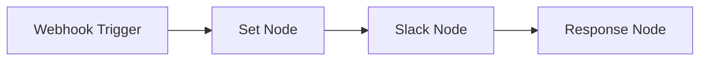
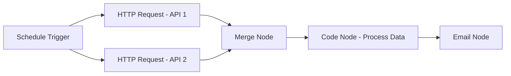
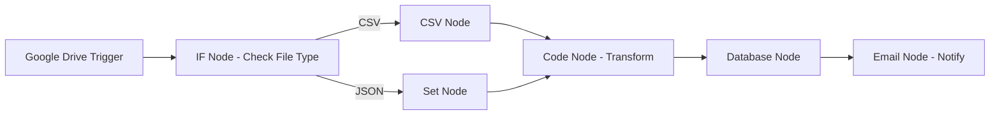

# n8n - Workflow Automation Platform

n8n is an open-source workflow automation tool that allows you to connect different services and automate tasks without writing code. It's like Zapier but self-hosted, giving you full control over your data and workflows.

---

## What is n8n?

n8n is a visual workflow automation platform that lets you:
- **Connect Services**: Integrate 400+ apps and services (APIs, databases, webhooks)
- **Automate Tasks**: Create workflows that run automatically or on triggers
- **Process Data**: Transform, filter, and manipulate data between services
- **Self-Host**: Run on your own infrastructure for data privacy and control
- **Visual Editor**: Drag-and-drop interface to build complex workflows

---

## Core Concepts

### Nodes
Building blocks of workflows that perform specific actions:
- **Trigger Nodes**: Start workflows (webhook, schedule, email, etc.)
- **Action Nodes**: Perform operations (HTTP request, database query, file operations)
- **Logic Nodes**: Control flow (IF/ELSE, merge, split)
- **Data Nodes**: Transform data (set, function, code)

### Workflows
Sequences of connected nodes that automate business processes:
- **Manual Trigger**: Run on-demand
- **Automatic Trigger**: Run on schedule or event
- **Error Handling**: Retry logic and fallback paths

### Credentials
Secure storage for API keys, passwords, and authentication tokens.

---

## Installation & Setup

### Docker (Recommended)
```bash
# Basic installation
docker run -it --rm --name n8n -p 5678:5678 n8nio/n8n

# With persistent data
docker run -it --rm --name n8n -p 5678:5678 -v ~/.n8n:/home/node/.n8n n8nio/n8n

# Production setup with environment variables
docker run -d \
  --name n8n \
  -p 5678:5678 \
  -v ~/.n8n:/home/node/.n8n \
  -e N8N_BASIC_AUTH_ACTIVE=true \
  -e N8N_BASIC_AUTH_USER=admin \
  -e N8N_BASIC_AUTH_PASSWORD=your-password \
  -e WEBHOOK_URL=https://your-domain.com/ \
  n8nio/n8n
```

### npm
```bash
npm install n8n -g
n8n start
```

### Docker Compose
```yaml
version: '3.8'
services:
  n8n:
    image: n8nio/n8n
    ports:
      - "5678:5678"
    environment:
      - N8N_BASIC_AUTH_ACTIVE=true
      - N8N_BASIC_AUTH_USER=admin
      - N8N_BASIC_AUTH_PASSWORD=your-password
      - WEBHOOK_URL=https://your-domain.com/
    volumes:
      - n8n_data:/home/node/.n8n

volumes:
  n8n_data:
```

---

## Common Use Cases

### 1. Data Synchronization
- Sync contacts between CRM systems
- Backup data from APIs to databases
- Mirror data across multiple platforms

### 2. Notification Systems
- Send Slack messages on form submissions
- Email alerts for system events
- SMS notifications for critical updates

### 3. Content Management
- Auto-post to social media platforms
- Generate reports from multiple data sources
- Process and categorize incoming files

### 4. Business Process Automation
- Lead scoring and routing
- Invoice processing
- Customer onboarding workflows

---

## Essential Nodes & Examples

### HTTP Request Node
Make API calls to external services:
```json
{
  "method": "POST",
  "url": "https://api.example.com/webhook",
  "headers": {
    "Authorization": "Bearer {{$credentials.apiKey}}",
    "Content-Type": "application/json"
  },
  "body": {
    "message": "Hello from n8n",
    "timestamp": "{{new Date().toISOString()}}"
  }
}
```

### Webhook Node
Receive incoming data from external services:
- **HTTP Method**: POST, GET, PUT, DELETE
- **Response Mode**: Response Node, Last Node, No Response Data
- **Authentication**: Basic Auth, Header Auth, Query Auth

### Schedule Trigger
Run workflows at specific times:
- **Cron Expression**: `0 9 * * MON-FRI` (9 AM weekdays)
- **Interval**: Every 5 minutes, hourly, daily
- **Time Zone**: Configure for your location

### Code Node
Execute custom JavaScript:
```javascript
// Process incoming data
const items = $input.all();
const processed = [];

for (const item of items) {
  const data = item.json;
  
  // Transform data
  processed.push({
    id: data.id,
    name: data.name.toUpperCase(),
    processed_at: new Date().toISOString()
  });
}

return processed.map(item => ({ json: item }));
```

### IF Node
Conditional logic:
- **Conditions**: Data comparison, expressions, regex
- **Multiple Conditions**: AND/OR logic
- **Output Paths**: True/False branches

### Set Node
Set data values:
- **Keep Only Set**: Replace all data
- **Keep Input**: Add to existing data
- **Delete**: Remove specified fields

---

## Workflow Examples

### 1. Form to Slack Notification


**Steps:**
1. **Webhook Trigger**: Receive form submission
2. **Set Node**: Format message data
3. **Slack Node**: Send message to channel
4. **Response Node**: Confirm submission

### 2. Daily Report Generation


**Steps:**
1. **Schedule Trigger**: Run daily at 9 AM
2. **HTTP Requests**: Fetch data from multiple APIs
3. **Merge Node**: Combine data streams
4. **Code Node**: Process and format data
5. **Email Node**: Send report

### 3. File Processing Pipeline


---

## Advanced Features

### Error Handling
```javascript
// In Code Node - try/catch example
try {
  const result = await $http.request({
    method: 'GET',
    url: 'https://api.example.com/data'
  });
  return [{ json: result.data }];
} catch (error) {
  // Handle error - send notification, log, etc.
  throw new Error(`API call failed: ${error.message}`);
}
```

### Sub-workflows
Create reusable workflow components:
1. Save workflow as sub-workflow
2. Call from other workflows using "Execute Workflow" node
3. Pass parameters and receive results

### Webhook Response
```javascript
// Return custom response
return [
  {
    json: { status: 'success', id: 123 },
    response: {
      statusCode: 200,
      headers: { 'Content-Type': 'application/json' }
    }
  }
];
```

### Batch Processing
```javascript
// Process items in batches
const items = $input.all();
const batchSize = 10;
const batches = [];

for (let i = 0; i < items.length; i += batchSize) {
  batches.push(items.slice(i, i + batchSize));
}

return batches.map(batch => ({ json: { batch } }));
```

---

## Best Practices

### 1. Workflow Design
- **Start Simple**: Begin with basic workflows, add complexity gradually
- **Test Frequently**: Use manual triggers during development
- **Document**: Add descriptions and comments to nodes
- **Error Handling**: Always include error paths and notifications

### 2. Performance
- **Batch Operations**: Process multiple items together when possible
- **Rate Limiting**: Respect API limits with delays between requests
- **Data Filtering**: Use IF nodes to avoid unnecessary processing
- **Resource Management**: Clean up temporary data and connections

### 3. Security
- **Credentials**: Use n8n's credential system, never hardcode secrets
- **Webhook Security**: Validate incoming webhook signatures
- **Environment Variables**: Use for configuration, not secrets
- **Access Control**: Enable authentication for production instances

### 4. Monitoring
- **Execution History**: Review workflow runs regularly
- **Error Tracking**: Set up alerts for failed executions
- **Performance Metrics**: Monitor execution times and resource usage
- **Logging**: Use Code nodes for custom logging

---

## Common Integrations

### Popular Services
- **Communication**: Slack, Discord, Teams, Email
- **Data**: Google Sheets, Airtable, MySQL, PostgreSQL
- **APIs**: REST, GraphQL, Webhooks
- **Cloud**: AWS, Google Cloud, Azure
- **CRM**: HubSpot, Salesforce, Pipedrive
- **Social**: Twitter, LinkedIn, Facebook

### Custom Integrations
```javascript
// Custom API integration in Code node
const apiKey = $credentials.apiKey;
const response = await $http.request({
  method: 'POST',
  url: 'https://api.customservice.com/endpoint',
  headers: {
    'Authorization': `Bearer ${apiKey}`,
    'Content-Type': 'application/json'
  },
  body: {
    data: $input.first().json
  }
});

return [{ json: response.data }];
```

---

## Troubleshooting

### Common Issues

**Workflow Not Triggering:**
- Check webhook URL configuration
- Verify schedule settings
- Ensure workflow is active

**Authentication Errors:**
- Verify credentials are correctly configured
- Check API key permissions
- Test credentials in node settings

**Data Format Issues:**
- Use Set nodes to structure data
- Add Code nodes for data transformation
- Check input/output data formats

**Performance Problems:**
- Add delays between API calls
- Use batch processing for large datasets
- Monitor execution history for bottlenecks

### Debugging Tips
```javascript
// Debug data in Code node
console.log('Input data:', JSON.stringify($input.all(), null, 2));
console.log('Credentials:', Object.keys($credentials));

// Return debug information
return [{
  json: {
    debug: true,
    input_count: $input.all().length,
    timestamp: new Date().toISOString()
  }
}];
```

---

## Production Deployment

### Environment Configuration
```bash
# Production environment variables
N8N_BASIC_AUTH_ACTIVE=true
N8N_BASIC_AUTH_USER=admin
N8N_BASIC_AUTH_PASSWORD=secure-password
WEBHOOK_URL=https://your-domain.com/
N8N_HOST=0.0.0.0
N8N_PORT=5678
N8N_PROTOCOL=https
```

### Database Setup
```yaml
# Docker Compose with PostgreSQL
version: '3.8'
services:
  postgres:
    image: postgres:13
    environment:
      POSTGRES_DB: n8n
      POSTGRES_USER: n8n
      POSTGRES_PASSWORD: password
    volumes:
      - postgres_data:/var/lib/postgresql/data

  n8n:
    image: n8nio/n8n
    environment:
      DB_TYPE: postgresdb
      DB_POSTGRESDB_HOST: postgres
      DB_POSTGRESDB_PORT: 5432
      DB_POSTGRESDB_DATABASE: n8n
      DB_POSTGRESDB_USER: n8n
      DB_POSTGRESDB_PASSWORD: password
    depends_on:
      - postgres

volumes:
  postgres_data:
```

### Backup Strategy
- **Database Backups**: Regular PostgreSQL/MySQL backups
- **Workflow Exports**: Export workflows as JSON files
- **Credential Backups**: Secure backup of credential configurations
- **File System**: Backup n8n data directory

---

## Resources & Learning

### Official Resources
- **Documentation**: https://docs.n8n.io/
- **Community Forum**: https://community.n8n.io/
- **GitHub**: https://github.com/n8n-io/n8n
- **Templates**: https://n8n.io/workflows/

### Learning Path
1. **Basics**: Start with simple webhook-to-email workflows
2. **Data Processing**: Learn Set, Code, and IF nodes
3. **Integrations**: Connect to your frequently used services
4. **Advanced**: Sub-workflows, error handling, and optimization
5. **Production**: Deployment, monitoring, and maintenance

### Community Templates
- Form processing workflows
- Social media automation
- Data synchronization
- Notification systems
- Report generation

---

## Alternatives & Comparisons

### vs Zapier
- **Pros**: Self-hosted, more flexible, better pricing for high volume
- **Cons**: Requires technical setup, smaller app ecosystem

### vs Microsoft Power Automate
- **Pros**: More integrations, better Microsoft ecosystem integration
- **Cons**: Windows-focused, less flexible for custom logic

### vs Make (Integromat)
- **Pros**: Visual interface, good for complex scenarios
- **Cons**: More expensive, less customization options

---

n8n is a powerful tool for automating business processes while maintaining control over your data and infrastructure. Start with simple workflows and gradually build more complex automations as you become comfortable with the platform.
